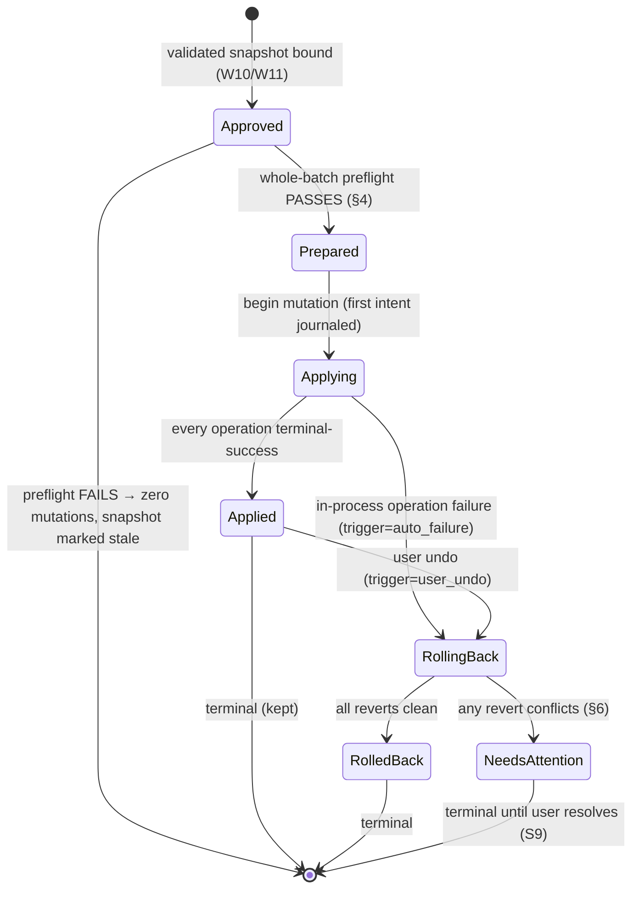

# R4 — Safety state-machine design

> Status: reviewed design, 2026-07-16. This is the contract for the sort
> journal/apply/undo lifecycle.
> Source of truth for scope: `docs/PRD.md` §7.3, §7.4, §7.5, §8. Consumed by
> W14 (journaled apply), W15 (immediate undo), S8 (crash-recovery engine), and
> S10 (full undo engine).

This document specifies the state machine that guarantees the PRD's hard safety
rule for sorting: **every source file is either fully moved to its planned
destination or left exactly where it started — never lost, overwritten, renamed,
or silently half-moved — even across a crash, kill, or power loss.** Downstream
issues implement the tables here verbatim; they should not re-derive behavior.

The PRD (§7.3 step 6) fixes the six durable batch states this machine uses:
`prepared`, `applying`, `applied`, `rolling_back`, `rolled_back`,
`needs_attention`. Everything below is consistent with that enumeration; where
the PRD leaves a mechanism unstated, the decision is recorded in §8.

---

## 1. Terminology and naming

The word "prepared" is overloaded across the issue plan. This document uses:

| Term | Meaning | Owner |
| --- | --- | --- |
| **Approved snapshot** | The immutable, validated plan snapshot that approval binds to. Called the "immutable prepared-plan store" in W11. | W10/W11 |
| **`prepared`** (journal state) | A batch that has passed whole-batch preflight authorization and captured its preconditions, with **zero mutations performed yet**. | This doc / W14 |

These are different things. To avoid a real correctness hazard, implementers
**must not** conflate the W11 "prepared plan" with the journal `prepared` state
(see §8, Q1). This document always writes "approved snapshot" for the former and
`prepared` for the latter.

A **batch** is one apply of one approved snapshot against one grant. A batch owns
an ordered list of **operations** (items): folder-creates first, then file-moves.

---

## 2. Lifecycle state model

### 2.1 Phases before the journal (context only)

These phases precede the journal and are owned by earlier issues; they are the
machine's entry contract, not journal states:

1. **Scanned** (W5/W6): top-level regular files get opaque IDs and immutable
   source fingerprints `(canonical path, size, mtime)`.
2. **Planned** (W9): the LLM returns an ID→category mapping. No paths.
3. **Validated** (W10): the deterministic validator accepts the plan (unique
   IDs, valid names, new-vs-existing destinations, all collision classes
   rejected).
4. **Approved snapshot** (W11): an immutable snapshot with exact operation
   counts and the disclosure manifest; approval binds to its hash. Any edit,
   expiry, grant change, or detected filesystem change invalidates it.

Apply begins from an approved, still-valid snapshot. The journal takes over here.

### 2.2 Batch states (durable, journaled)

| State | Meaning | Terminal? |
| --- | --- | --- |
| `prepared` | Whole-batch preflight passed; preconditions captured; nothing mutated. | no |
| `applying` | Mutation in progress; some operations may be done, some pending. | no |
| `applied` | Every operation completed successfully. Sort is done. | yes (kept) |
| `rolling_back` | Reverse replay in progress — either auto-triggered by an apply failure/interrupted apply, or user-triggered undo. | no |
| `rolled_back` | Reverse replay completed cleanly; net effect is zero moves. | yes |
| `needs_attention` | The machine reached a state it will not resolve autonomously without risking a safety rule. Surfaced to the user (S9). | yes until resolved |

A `trigger` field on the batch discriminates why a rollback is happening —
`auto_failure` (in-process apply error), `user_undo` (S5/W15/S10), or `recovery`
(interrupted apply reversed on next launch). The state set stays at the PRD's six
(see §8, Q2); the UI reads `trigger` to phrase the outcome ("sort failed and was
reverted" vs "you undid your sort").

### 2.3 Operation (item) states (durable, journaled)

Each operation carries its own durable sub-state so recovery is deterministic per
item, not just per batch.

**Folder-create item:**

| State | Meaning |
| --- | --- |
| `pending` | Not yet attempted. |
| `attempting` | Intent journaled; `mkdir` may or may not have happened (in-doubt window). |
| `created` | Directory created by us (`createdByUs = true`). |
| `exists` | Destination already existed; we created nothing (`createdByUs = false`). |
| `failed` | `mkdir` failed; carries a reason. |
| `removed` | Folder we created was removed during rollback/undo (was empty). |
| `remove_skipped` | Folder left in place during rollback/undo (non-empty, or pre-existing). |

**File-move item:**

| State | Meaning |
| --- | --- |
| `pending` | Not yet attempted. |
| `attempting` | Intent journaled; the atomic move may or may not have landed (in-doubt window). |
| `moved` | File is at the destination; `postMoveFingerprint` captured. |
| `failed` | Move failed (e.g., destination appeared → `EEXIST`); carries a reason. |
| `reverting` | Reverse move in progress. |
| `reverted` | File is back at its original source path. |
| `revert_conflict` | Could not revert safely (see §6); file left at destination; contributes to `needs_attention`. |

### 2.4 Batch state diagram

Recovery on launch (S8) re-enters `applying` and `rolling_back` from the journal
and drives them forward per §5; those transitions are the recovery table, not
new states.

---

## 3. Write-ahead protocol and durability

The journal is **write-ahead**: intent is recorded and flushed *before* every
filesystem mutation, and the result is recorded and flushed *after*. This is what
makes the in-doubt window bounded and probeable.

**Batch start.** After a fully successful preflight (§4) and immediately before
the first mutation, write the batch record as `prepared` — snapshot ref +
snapshot hash, grant ID, the full ordered operation list, and every captured
precondition — then `fsync`.

**Per operation, in order (folder-creates before the moves that target them):**

1. Write item `attempting` (with resolved paths, fingerprint, and — for folders —
   the observed pre-existence), then `fsync` the journal.
2. Perform exactly one filesystem primitive:
   - folder: `mkdir` (only if it did not already exist), recording `createdByUs`;
   - move: **one atomic, no-clobber, intra-volume move** (§7, I6).
3. Write the item result (`created`/`exists`/`moved`, or `failed`), then `fsync`.

**Batch finish.** When all operations are terminal-success, write batch `applied`
and `fsync`.

Durability requirements for W14:

- `fsync` the journal file (and its parent directory on first create) so records
  survive power loss, not just process death.
- The journal lives in the app data directory (W1), separate from the index, and
  is excluded from indexing (PRD §7.1). "Delete my local data" (P11) wipes it.
- The journal stores canonical paths because it must; **logs and crash reports
  never do** (PRD §8, P12). This is a deliberate split: the journal is local,
  user-wipeable state; logs are diagnostic and path-free.

---

## 4. Preflight atomicity rule (whole-batch authorization)

> **Rule: either the entire batch is authorized and the machine proceeds to
> mutate, or not one folder is created and not one file is moved.**

Preflight runs once, immediately before `prepared`, and is **strictly
read-only** — no `mkdir`, no move, no journal `applying` record. A batch is
**authorized** only if *every* check below holds for *every* operation. The first
failing check aborts the whole batch with zero mutations.

For the batch:

1. The grant is present and not revoked.

For every source and destination path:

2. It canonicalizes to a location contained within the granted folder, checked
   symlink-safely (real-path containment, never a string-prefix test — PRD §7.5).

For every source file:

3. Its opaque ID resolves to an existing **regular file** whose canonical path,
   size, and mtime exactly match the fingerprint bound into the snapshot — i.e.
   it was **not modified, replaced, or removed** since the scan.
4. It is not a live skip-class item (symlink/alias, package bundle, hidden/
   dotfile, temp/partial download) — re-checked against the live filesystem, not
   trusted from scan time.

For every destination:

5. A new destination folder does not yet exist as a file, and its parent is
   writable; an existing destination folder is a real directory within the grant.
6. The **final target path** (destination folder + the file's unchanged basename)
   **does not currently exist**, compared case-insensitively and under Unicode
   normalization on the actual target volume (never-overwrite precondition).

Across the batch:

7. No two operations share a source or a final destination (validator invariant
   from W10, re-checked live).
8. Every move resolves same-volume (intra-volume; see §7, I6). A cross-volume
   destination is a preflight failure — never downgraded to copy+delete.

**On any failure:** no apply journal record is written (the batch never reaches
`prepared`). The approved snapshot is marked stale/invalid (W11) and the user is
shown the specific failing precondition (e.g. "3 files changed since the plan was
made — regenerate"). Because preflight is read-only and total, "no moves happen"
is airtight: a single failed check anywhere means mutation never started.

**On success:** write `prepared` (§3) and proceed. Authorization is captured at
that instant; §5 and §7 handle the residual TOCTOU window between authorization
and each individual move.

---

## 5. Crash points and recovery decision table

### 5.1 Crash-point enumeration

Every point where a crash/kill/power-loss can land, and the exact on-disk state:

| # | Crash point | Journal on disk | Filesystem | Recoverable because |
| --- | --- | --- | --- | --- |
| C0 | Before/within preflight | no batch record | untouched | preflight is read-only |
| C1 | After `prepared`, before first item intent | batch `prepared`, no item results | untouched | `prepared` guarantees zero mutations |
| C2 | After item `attempting`, before the fs op | item `attempting` | op not applied | atomic op ⇒ file still fully at source |
| C3 | **During** the atomic `mkdir`/move | item `attempting` | op atomically applied or not — never split | rename/mkdir is atomic; probe resolves it |
| C4 | After the fs op, before item result | item `attempting` | op applied | probe finds file at destination ⇒ treat as done |
| C5 | After item result, before next item | item terminal, later items `pending` | partial | per-item states are exact |
| C6 | After last item, before batch `applied` | `applying`, all items terminal-success | fully applied | roll forward is a no-op commit |
| C7 | During auto-rollback or user undo | `rolling_back`, mixed item states | partially reverted | reverse replay is idempotent + probes |
| C8 | After a terminal state | `applied` / `rolled_back` / `needs_attention` | consistent | terminal; recovery is a no-op |

The only in-doubt evidence a crash can leave is an item stuck at `attempting`
(C2–C4). Because the single fs primitive is atomic (§7, I6), a live probe finds
the file **either** fully at its source **or** fully at its destination — never
both and never neither — so the item's true state is always recoverable.

### 5.2 Recovery decision table (S8 implements this verbatim)

On launch, before the normal shell renders, S8 reads each non-terminal batch and
applies exactly one action. The action is a pure function of `(batch state, item
evidence, live filesystem)` and is safe to repeat (idempotent).

| Batch state | Item evidence | Recovery action | Resulting state |
| --- | --- | --- | --- |
| *(no record)* | — | none | — |
| `prepared` | *(no item results — invariant)* | Abandon: nothing was mutated. Close the batch. If any item record unexpectedly exists, treat as `applying` instead (defense in depth). | `rolled_back` (`trigger=recovery`, note "never entered applying") |
| `applying` | **all** items terminal-success (`moved`/`created`/`exists`) | **Roll forward**: only the final marker was lost; commit it. No filesystem change. | `applied` |
| `applying` | **any** item `pending`, `attempting`, or `failed` | **Roll back**: resolve every `attempting` item by probe, then reverse-replay all `moved` items to their sources and remove our still-empty created folders (§6 rules). | `rolled_back`; or `needs_attention` if a revert conflicts |
| `rolling_back` | any | **Resume rollback**: continue the reverse replay from item states + probe; idempotent. | `rolled_back`; or `needs_attention` |
| `applied` | — | none (terminal success) | `applied` |
| `rolled_back` | — | none (terminal) | `rolled_back` |
| `needs_attention` | — | none automatically; surface to the user (S9) with safe next actions. | `needs_attention` |

Rationale for the `applying` split: an apply that was genuinely interrupted
mid-way is reverted to the pre-apply state so the atomicity guarantee ("or no
moves happen") also holds across a crash; but if *every* operation had actually
finished and only the `applied` marker was lost, reverting would needlessly undo
a completed sort, so that case rolls forward. Both branches are deterministic
from the item evidence. The user is notified in chat of any recovery outcome
(S7/S9); recovery never applies silently.

**Idempotency contract:** running recovery N times yields the same terminal
state as running it once. Each reverse-move probes the live filesystem first and
no-ops if already in the target state; each folder removal re-checks emptiness.

---

## 6. Undo / rollback conflict matrix (S10 implements this)

Rollback and user undo share one reverse-replay engine over the journal. They
differ only in `trigger`. The engine walks moves in reverse and, for each one,
returns the file from its current destination to its original source path — but
**only** if that can be done without breaking a safety rule. Then it cleans up
folders it created.

The honest guarantee (PRD S5): *immediate undo restores every file whose original
location is still available; conflicts are surfaced and never overwritten.* The
matrix below is exactly that rule, enumerated.

### 6.1 Per file-move outcomes

| # | Condition at rollback/undo time | Detection | Outcome |
| --- | --- | --- | --- |
| 1 | **Normal** — file still at destination, original source path is free | dest holds our file (fingerprint matches `postMoveFingerprint`); source path absent | Revert with an atomic no-clobber move back to source → `reverted`. |
| 2 | **Origin occupied** — something now exists at the original source path | source path exists | Do **not** overwrite. Leave the file at the destination → `revert_conflict (origin_occupied)`. Batch → partial. |
| 3 | **File modified in place** since the move | dest fingerprint ≠ `postMoveFingerprint`, but it is still the same file (same identity) | Origin is free, so reverting overwrites nothing: move it back but flag `reverted (modified_since_move)` so the user knows content changed. If origin is also occupied, resolve as row 2. |
| 4 | **File already gone** from the destination (user/other process moved or deleted it) | dest path absent | Nothing to revert. Record `source_missing` as informational; do not block other files. Contributes to partial, not to `needs_attention` by itself. |
| 5 | **Destination replaced** — a *different* file now sits at the destination path | dest present but identity/fingerprint differs from what we moved | Not ours → do not touch it → `revert_conflict (destination_replaced)`. Batch → partial. |
| 6 | **Destination folder gone/renamed** since apply | destination parent absent | The file is not where we left it and cannot be located deterministically → `revert_conflict (destination_changed)`. Batch → partial. |
| 7 | **Grant revoked / folder unavailable** since apply | grant/containment check fails | Do not access it. Abort the reverse replay for that grant with **zero** mutation → batch `needs_attention (unavailable)`. |

"Same identity" in rows 3/5 is checked with a stable file identity (device +
inode captured at move time) in addition to the fingerprint, so a
same-size/same-mtime replacement is still detected as *not ours*.

### 6.2 Created-folder cleanup (runs after moves are reverted)

| Condition | Detection | Outcome |
| --- | --- | --- |
| Folder we created is now **empty** | `createdByUs = true`, `readdir` empty | `rmdir` it → `removed`. |
| Folder we created is now **non-empty** | `createdByUs = true`, `readdir` non-empty | Leave it → `remove_skipped`. Never remove a folder holding files (a file we couldn't revert, or one the user added). |
| **Pre-existing** destination folder | `createdByUs = false` | Never touch it → `remove_skipped`, regardless of emptiness. |

### 6.3 Batch-level undo outcomes

| Outcome | When | Batch end state |
| --- | --- | --- |
| **Complete** | every move reverted (rows 1/3), our empty folders removed | `rolled_back` |
| **Partial** | some reverted, some conflicts (rows 2/4/5/6) surfaced per file | `needs_attention` |
| **Unavailable** | grant/folder inaccessible (row 7); nothing mutated | `needs_attention` |

These are S10's three outcomes. Duplicate undo of a batch already in a terminal
reverse state (`rolled_back`) is rejected as a no-op with a clear message; undo
is one-shot. An undo interrupted by a crash resumes via §5.2 (`rolling_back`).

---

## 7. Invariants and safety guarantees

The machine enforces the PRD's hard rules. Each maps to a concrete mechanism so
tests (W14/W15/S8/S10/S11) can assert it directly.

| # | Invariant (PRD) | Enforcing mechanism |
| --- | --- | --- |
| I1 | **Never overwrite** | Preflight §4.6 rejects an occupied target; the move primitive is atomically *exclusive* (fails with `EEXIST` if the target appears after preflight); reverts (§6) refuse an occupied origin. |
| I2 | **Never delete user files** | The only mutations are `mkdir` and file-move; the only removal is `rmdir` of an **empty folder we created**. A file is never `unlink`ed except as the trailing half of a same-volume move that has already placed the file at its destination (no data is ever without a link). |
| I3 | **Never rename files (v1)** | A move preserves the basename; only the parent directory changes. |
| I4 | **Opaque IDs only** | The renderer/model never see or supply paths; the main process resolves IDs → canonical paths and enforces symlink-safe grant containment on every operation (PRD §7.5). |
| I5 | **Whole-batch atomic authorization** | Read-only, total preflight before any mutation (§4). |
| I6 | **Atomic, intra-volume moves only** | Every move is one same-volume, no-clobber atomic operation. Preferred primitive: Darwin `renamex_np(..., RENAME_EXCL)`. Portable fallback: `link(src,dst)` (fails `EEXIST` if occupied, `EXDEV` if cross-volume — both desirable) then `unlink(src)`, journaled so a crash with both links present recovers as `moved`. Plain clobbering `rename(2)` is **forbidden**. Cross-volume is rejected in preflight (never copy+delete — that would risk I2). |
| I7 | **Write-ahead durability** | Intent `fsync`'d before each mutation; result `fsync`'d after (§3). |
| I8 | **Deterministic, idempotent recovery** | Recovery is a pure function of journal + live FS; repeated launches converge (§5.2). |
| I9 | **No silent partial success** | An incomplete apply ends in `rolled_back` or `needs_attention` — never a quietly half-done `applied`. |
| I10 | **Local, path-free diagnostics** | The journal holds paths (it must) in wipeable local app data; logs/crash reports contain no paths, names, or document text (PRD §8, P12). |

---

## 8. Open questions and assumptions

Items the PRD leaves unstated that this design resolves; each is flagged so a
reviewer can confirm or redirect before W14/W15/S8/S10 build against it.

- **Q1 — Naming overlap (resolved here, needs adoption).** W11's "immutable
  prepared-plan store" and the journal `prepared` state are different concepts.
  This doc uses "approved snapshot" and `prepared` respectively; recommend W11's
  issue text adopt "approved snapshot" to remove the hazard. **Assumption:** the
  approved snapshot exposes a stable `snapshotId` + content hash the batch record
  can reference and re-verify at preflight.

- **Q2 — Undo state modeling.** User undo reuses `rolling_back`/`rolled_back`
  with `trigger=user_undo` rather than adding `undoing`/`undone`, to stay within
  the PRD's six enumerated states. Recovery treats auto-rollback and user-undo
  identically (resume the reverse replay), so the reuse is clean. Confirm this
  is preferred over introducing distinct undo states.

- **Q3 — Interrupted-`applying` policy.** An apply interrupted mid-way rolls
  **back** on next launch (unless every operation had actually finished, which
  rolls forward). This favors the atomicity guarantee over completing a sort the
  user cannot re-confirm. Confirm the product accepts "an interrupted sort
  reverts itself, with a chat notice" as the default (S7/S9 surface it).

- **Q4 — Auto-rollback vs immediate `needs_attention` on in-process failure.**
  An fs error during a live apply triggers automatic rollback; only a *conflict
  during that rollback* escalates to `needs_attention`. This makes the common
  failure land the user back at a clean start rather than in a triage state,
  while still guaranteeing no silent partial success. Confirm.

- **Q5 — Exclusive-move primitive availability (W14 spike).** Node's `fs.rename`
  clobbers and exposes no exclusive flag. W14 must land I6's property via either
  a small native binding to `renamex_np(RENAME_EXCL)` or the journaled
  `link`+`unlink` fallback, and prove it under fault injection. This is an
  implementation risk, not a design change: the *property* (atomic, no-clobber,
  intra-volume) is non-negotiable.

- **Assumption — same-volume destinations.** Destinations are new or existing
  subfolders of the one selected top-level granted folder (PRD §7.4), so every
  move is intra-volume and therefore atomic. Any destination that resolves
  cross-volume (e.g. a firmlink/mount boundary) is a preflight failure (§4.8),
  not a copy+delete.

- **Assumption — one batch mutates at a time.** Apply and undo hold an exclusive
  lock per grant (and the app is single-user, single-window). Concurrent applies
  against the same grant are out of scope for v1; the recovery table assumes at
  most one non-terminal batch per grant is mid-flight.
